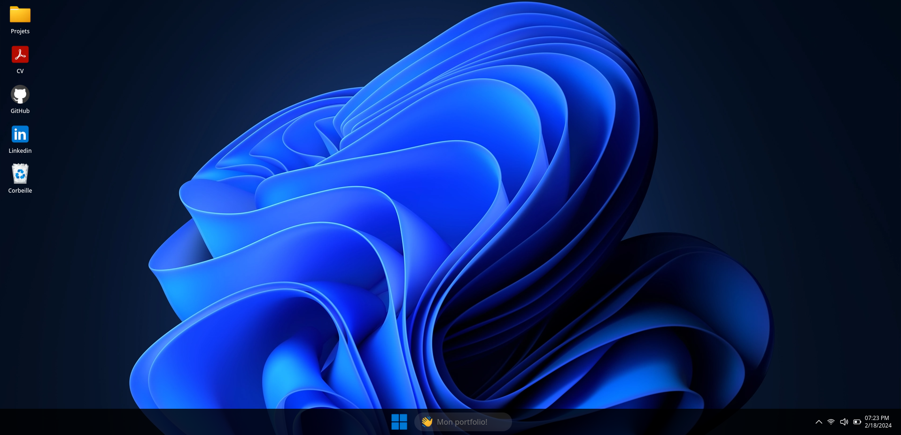

# Portfolio - Windows 11 Inspired Website Clone

This project is a personal portfolio designed and developed using Next.js, featuring a user interface inspired by the design of Windows 11.

## Overview



## Features

- User interface inspired by Windows 11
- Showcase of personal and professional projects
- Window of your personnal **resume**

## Prerequisites

Make sure you have the following installed on your machine before getting started:

- Node.js
- npm (Node.js package manager)

## Installation

1. Clone this repository to your local machine using the following command:
   ```bash
   git clone https://github.com/rwmicro/portfolio.git
   ```

2. Navigate to the project directory:
   ```bash
   cd portfolio
   ```

3. Install necessary dependencies:
   ```bash
   npm install
   ```

## Usage

Add your personnal resume in the public folder as a name `resume.pdf`.

To launch the application in development mode, use the following command:
```bash
npm run dev
```

Once the server is running, open your web browser and go to the following URL:
```
http://localhost:3000
```

## License

This project is licensed under the [MIT License](https://opensource.org/licenses/MIT).